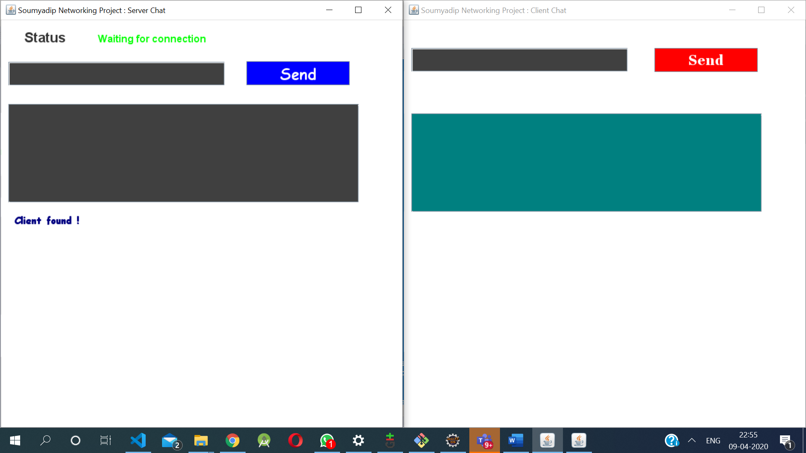
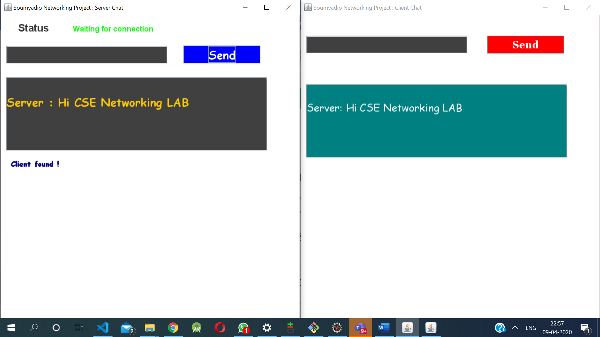
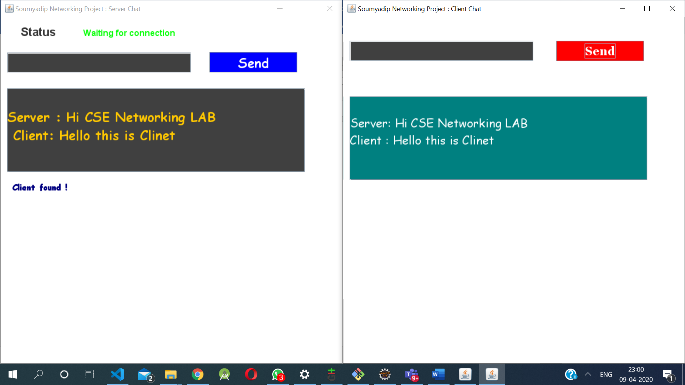
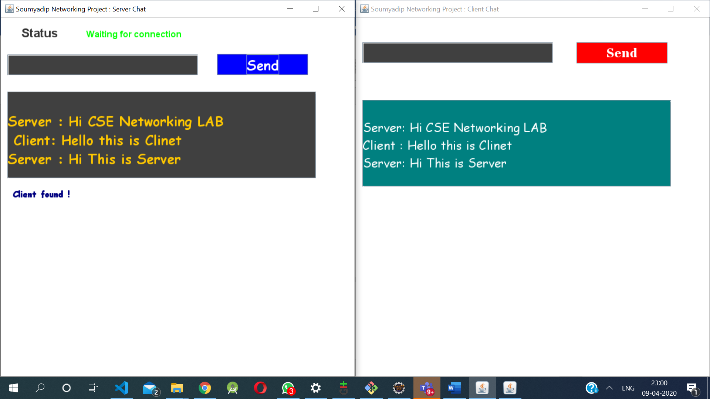
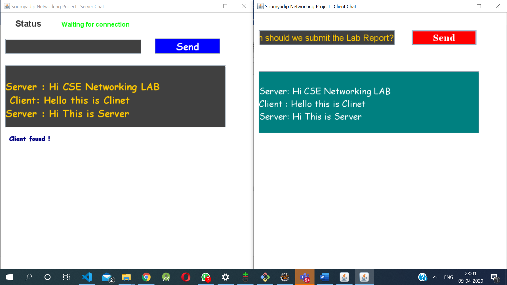
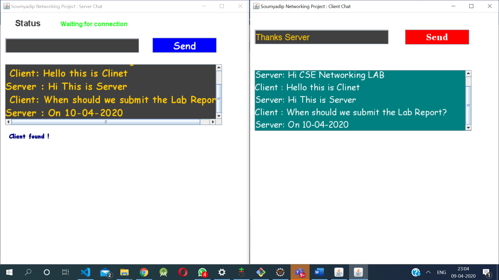
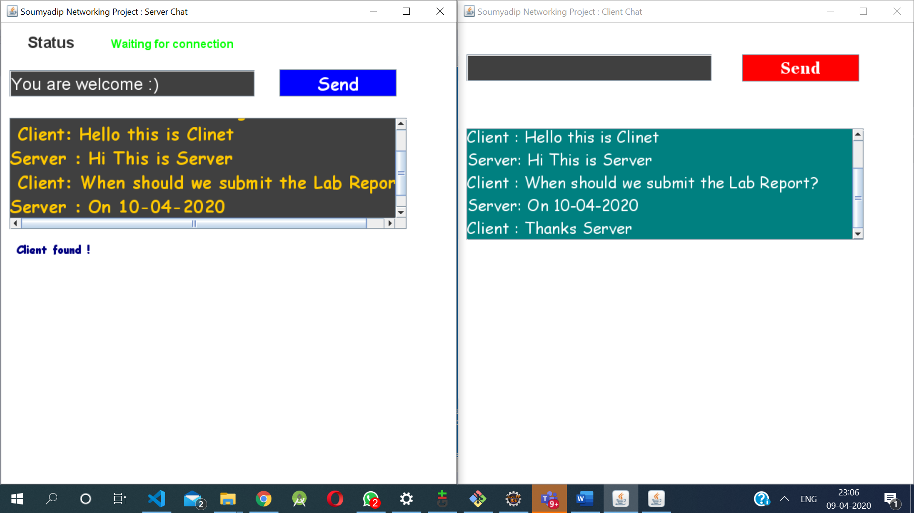

# Chat-Server-Application-Using-JAVA-Swing-Socket-Swing (With analysis Report)
Socket programming is a way of connecting two nodes on a network to communicate with each other. One socket(node) listens on a particular port at an IP, while other socket reaches out to the other to form a connection. Server forms the listener socket while client reaches out to the server.

# INTRODUCTION
Several network systems are built to communicate with one another and are made available through service-oriented architectures. In this project, we use the client-server architecture to develop a secured Client-Server chat application. A chat application is created based on Transmission Control Protocol (TCP) where TCP is connection oriented protocol and in the end, multithreading is used to develop the application. 


A client-server chat application consists of a Chat Client and a Chat Server and there exists a two way communication between them. Here, Message Processor is used to interpret message from the user, Message Interpreter is used to extract and pass the received message. Message Maker is used to construct back the message and Client Manager is used to maintain the clients list which the sender and receiver at both sides use to interact with each other. 

In general, the server process will start on some computer system; in fact, the server should be executed before the client. Server usually initializes itself, and then goes to wait state or sleep state where it will wait for a client request. After that, a client process can start on either the same machine or on some other machine. Whenever the client wants some service from the server, it will send a request to the server and the server will accept the request and process it. After the server has finished providing its service to the client, the server will again go back to sleep, that is, waiting for the next client request to arrive. This process is repeated as long as the server processes is running. Whenever such request comes, the server can immediately serve the client and again go back to the waiting state for the next request to arrive. 


# BACKGROUND OF THE STUDY 
Client server model is the standard model which has been accepted by many for developing security network applications. In this model, there is a notion of client and notion of server. 


A chat application is basically a combination of two applications: 
•	Server application 
•	Client application 


Server application runs on the server computer and client application runs on the client computer (or the machine with server). In this chat application, a client can send data to anyone who is connected to the server. 
Python application programming interface (API) provides the classes for creating sockets to facilitate program communications over the security network. Sockets are the endpoints of logical connections between two hosts and can be used to send and receive data. Python treats socket communications much as it treat input and output operations; thus programs can read from or write to sockets as easily as they can read from or write to files. 


To establish a server connection, a server socket needs to be created and attached to a port, which is where the server listens for connections. The port recognizes the Transmission Control Protocol service on the socket. For instance, the email server runs on port 25, and the web server usually runs on port 8080. 


Server Execution: At server the side, a thread is created which receives numerous clients’ requests. It also contains a list in which Client’s name and IP addresses are stored. When a client logs out, the server deletes that particular client from the list and updates the list 


Client Execution: A client firstly must have to register itself by sending username to the server and then any of two registered clients can communicate with each other. 

# DEFINITION OF TERMS 

Socket: Socket is a standard connection protocol that supports data communication over the security network between connected terminals. The standard connection supports the data transmission both by the TCP and UDP protocols between the terminals. 

TCP: TCP is a transport layer protocol used by applications that require guaranteed delivery of data. Basically, it is a connection oriented protocol. To communicate over TCP one must first have to establish a connection between pair of sockets, where one socket is client and the other belongs to server. After the connection is established between them then they can communicate with each other. 

Client: A client is a system that accesses or desires for a service made accessible by a server. 

Server: A server is a system (hardware or software) program running to provide the service requests of other system programs. 

Port: Port is a software mechanism that allows the centralized connected Servers to listen for requests made by clients. Port is actually purposed as a gateway to listen for the requested parameters by the server terminals or other machines. It is a software address on a system that is on the security network. Entire request response proceeding among this Application is carries through machine ports. 

Security network: This refers to a system were computers are linked to share software, data, hardware and resources for the benefit of users. 

Interface: This may be software or hardware that upon an agreed method spells out the manner a system component can exchange information with another system component. 

Secure socket layer (SSL): This refers to Secure Sockets Layer protocol that is used for encryption of data for secure data transmission. 

IP: This refers to Internet Protocol; it is the reasonable security network address of device on a security network. It is notational called dotted-decimal (for instance: 127.0.0.1). 


SWING (GUI Component): Swing is a GUI widget toolkit for Java. It is part of Oracle's Java Foundation Classes – an API for providing a graphical user interface for Java programs. Swing was developed to provide a more sophisticated set of GUI components than the earlier Abstract Window Toolkit.


# Output



				
				
				
				
				
				
				


## Copyright @soumyadip007
```shell
/**
 * 
 * @author Soumyadip Chowdhury
 * @github soumyadip007
 *
 */

```
Released under the Apache License 2.0. See the [LICENSE](https://github.com/codecentric/springboot-sample-app/blob/master/LICENSE) file.
# #Java Software (AWT/Swing/JavaFx/JDBC)

- [Java Swing 4 Projects Book selling system,Stadium Management,Chatbot etc](https://github.com/soumyadip007/Java-JavaFx-Swing-Projects-Desktop-Application-GUI-Software)

- [School Management System Software](https://github.com/soumyadip007/School-Management-System-GUI-Software-Using-Java-Swing-AWT-JDBC-JTatoo-MySql)

- [Java Swing Complete tutorial with example for JavaGuides.net](https://github.com/soumyadip007/Java-Swing-tutorials-and-examples-for-JavaGuides.net)


# #J2EE (JSP/Servlet/JSTL/JDBC Projects)

- [E-Market Place OLX-Clone](https://github.com/soumyadip007/E-Marketplace-for-buying-and-reselling-products-Web-Project-Using-JSP-Servlet-Jstl-Security-Jdbc)

- [Startup Company Live Website](https://soumyadip007.github.io/Coding_Liquids-StartUp-Company-Live-Website-Using-JSP-Servlet-JSTL-Security-JDBC-MD5-MySql-Bootstrap/)

- [Post-Disaster Management & Women Safety Project](https://github.com/soumyadip007/Post-Disaster-Management-and-Women-safety-Hackathon-JSP-Servlet-MySql-Bootstrap-GoogleMapApi-OSM)

- [Aim-India-Foundation-NGO-Live-Website](Aim-India-Foundation-WebDev-Internship-Using-Jsp-Servlet-Jstl-Jdbc-MySql-Bootstrap)

- *https://Lightningspeedmatchmaker.com* (in Private repo for security/commercial purposes,USA project)


# #Spring & Hibernte (Codes & Projects)

- [Spring-Core-XML-Data-Dependency-BeanScope-BeanLifecycle](https://github.com/soumyadip007/Spring-Core-XML-Data-Dependency-BeanScope-BeanLifecycle)

- [Spring-Core-Annotation](https://github.com/soumyadip007/Spring-Core-Annotation-BeanScope-BeanLifecycle)

- [Hibernate-ORM (All)](https://github.com/soumyadip007/Hibernate-ORM-Entity-Relations)

- [Spring-MVC-Request-Mapping-Validation](https://github.com/soumyadip007/Spring-MVC-Request-Mapping-Validation)

- [Customer-Tracker-CURD-Application-Using-Spring-MVC-Hibernate (Mini-Project)](https://github.com/soumyadip007/Customer-Tracker-CURD-Application-Using-Spring-MVC-Hibernate)

- [Spring-Security-User-Login-Authentication-Application-JDBC-Bcrypt](https://github.com/soumyadip007/Spring-Security-User-Login-Authentication-Application-JDBC-Bcrypt)

- [Spring-Security-Authentication-System-Registration-Login-with-OTP-Token-and-Email-verification (Mini Project)](https://github.com/soumyadip007/Spring-Security-Authentication-System-Reg-Login-with-OTP-Token-and-Email-verification)

- [SpringRest-Restfull-Webserices-Jackson-Json-Data-Binding-MVC](https://github.com/soumyadip007/Spring-Rest-Jackson-Json-Data-Binding)

- [Customer-Relationship-Management-Real-time-CURD-Application-using-Spring-Rest-Json-HQL-WebServices-MVC (Mini Project)](https://github.com/soumyadip007/Customer-Relationship-Management-Real-time-CURD-Application-using-Spring-Rest-Json-HQL-WebServices)

- [Spring-Boot-with-Restfull-Webservices-Json-Hibernate-JPA-Spring-Data](https://github.com/soumyadip007/Spring-Boot-with-Rest-Json-Hibernate-JPA-SpringDataJPA)

- [Employee-Relationship-CURD-Application-using-Spring-Boot-Thymeleaf-Hibernate-JPA-MVC (Mini Project)](https://github.com/soumyadip007/Employee-Relationship-CURD-Application-using-Spring-Boot-Thymeleaf-Hibernate-JPA-MVC)

- [E-Medical-System (Project)](https://github.com/soumyadip007/E-Medical-System-Web-Project-Using-Spring-Boot-Security-MVC-Hibernate-JPA-Rest-Thymeleaf-HQL)

- [SpringBoot-Angular8-Login-Registration](https://github.com/soumyadip007/SpringBoot-Angular8-Login-Registration-for-JavaGuides.net)

- *Pujo Direction* (Android/WEB(Spring Boot, MVC, REST, Security, Hibernate, JPA, Thymeleaf) http://pujodir.cloudjiffy.net/Pujo-Direction(App Store)) (in Private repo for security purposes)

# #Angular8 (Codes & Projects)

- [Angular8-Data-Event-Binding-Directives-Pipes-Form-Validation-Security-HTTP-Service-Routing](https://github.com/soumyadip007/Angular-8-Data-Event-Binding-Directives-Pipes-Form-Validation-Security-HTTP-Service-Routing)

- [Angular-Firebase-CURD-Application](https://github.com/soumyadip007/Angular-Firebase-CURD)

- [Angular8-Authentication-and-Authorization-JSON-JWT (Security)](https://github.com/soumyadip007/Angular-8-Authentication-and-Authorization-JSON-JWT)

- [Angular8 & Redux](https://github.com/soumyadip007/Angular-8-Redux)

- [Shopping-Cart-System-using-Angular-8-Auth-Module-Firebase (Mini Project)](https://github.com/soumyadip007/Shopping-Cart-System-using-Angular-8-Auth-Module-Firebase)

- [SpringBoot-Angular8-Login-Registration](https://github.com/soumyadip007/SpringBoot-Angular8-Login-Registration-for-JavaGuides.net)

# #Other Works

- [DBJ.jar (Framework for JDBC/On progress)](https://github.com/soumyadip007/DBJ.jar)

- [Ofline Route Builder & DTN (On progress)](https://github.com/soumyadip007/Offline-Route-Builder-DTN-Messenger-Android-GPS-OSM)

# #Wiki: https://github.com/soumyadip007/E-Medical-System-Web-Project-Using-Spring-Boot-Security-MVC-Hibernate-JPA-Rest-Thymeleaf-HQL/wiki
